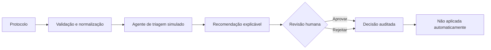

# Protocol Intelligence

Plataforma de acompanhamento e triagem assistida de protocolos, construída com React, Fastify, PostgreSQL e uma arquitetura preparada para agentes de IA com supervisão humana.

> O MVP agentic é determinístico, offline e utiliza somente dados simulados. Recomendações nunca alteram protocolos automaticamente.

## Visão do produto

Protocol Intelligence transforma um dashboard operacional em uma base de engenharia AI-native. O sistema consolida protocolos, calcula indicadores, acompanha SLA e oferece recomendações explicáveis de prioridade e roteamento.

O fluxo mantém **human-in-the-loop** em todas as decisões:



## Capacidades

- dashboard responsivo com KPIs, filtros, gráficos, busca e exportação CSV;
- central de triagem com fila, prioridades, confiança média e alertas;
- recomendação estruturada de prioridade e unidade;
- justificativas, confiança e guardrails visíveis;
- trilha do agente: análise, recomendação, revisão humana e não execução;
- API REST Fastify protegida por chaves separadas de leitura e operação;
- persistência PostgreSQL com Prisma e ingestão idempotente;
- cálculo de SLA em dias úteis;
- fallback para Google Sheets, dados mock e cache local;
- CI independente para frontend e backend.

## Guardrails de IA

- campos do protocolo são tratados como dados não confiáveis;
- instruções inseridas no assunto não controlam o agente;
- o provider MVP não acessa rede nem modelos externos;
- toda recomendação nasce como `PENDING`;
- aprovação ou rejeição exige ação humana;
- dupla decisão é recusada;
- nenhuma chave operacional é incluída no bundle frontend;
- a interface identifica claramente toda simulação.

## Arquitetura

```text
React / Vite
  ├─ Dashboard, filtros e visualizações
  ├─ Central de triagem agentic
  └─ Demonstração local segura
              │
              ▼
Fastify / TypeScript
  ├─ Protocolos, KPIs e SLA
  ├─ Ingestão e movimentações
  └─ Recomendações e decisões auditáveis
              │
              ▼
Prisma / PostgreSQL
```

| Camada | Tecnologias |
| --- | --- |
| Frontend | React 19, Vite 8, Chart.js |
| Backend | Node.js, TypeScript, Fastify |
| Dados | PostgreSQL, Prisma |
| Qualidade | Node Test Runner, Vitest, Oxlint, GitHub Actions |
| Operação | Docker Compose, Nginx, Pino |
| Integração legada | Google Apps Script / Sheets |

## Início rápido — demonstração frontend

```bash
npm install
npm run dev
```

Acesse `http://127.0.0.1:5173`. Sem configuração externa, o sistema usa dados simulados.

## Stack completa com Docker

```bash
docker compose up --build
```

- Frontend: `http://127.0.0.1:8080`
- API: `http://127.0.0.1:3333/api/health`
- PostgreSQL: `localhost:5432`

As credenciais do `docker-compose.yml` são apenas defaults locais. Substitua-as antes de qualquer ambiente compartilhado.

## Comandos de qualidade

```bash
npm test
npm run lint
npm run build

cd backend
npm test
npm run build
npm run db:generate
```

## API de triagem

| Método | Rota | Responsabilidade |
| --- | --- | --- |
| `POST` | `/api/protocolos/:id/triagens` | Gerar recomendação pendente |
| `GET` | `/api/protocolos/:id/triagens` | Consultar histórico |
| `POST` | `/api/triagens/:id/decisao` | Aprovar ou rejeitar uma vez |

As rotas operacionais não devem ser chamadas diretamente pelo browser com uma chave privilegiada.

## Estrutura

```text
backend/                 API, domínio, Prisma e testes Vitest
src/components/          dashboard e experiência agentic
src/services/            contratos, fontes e provider simulado
tests/                   testes do frontend e regras puras
google-apps-script/      adaptador transitório do Sheets
docs/                    documentação técnica reconstruível
specs/                   especificações e evidências Specsfy
.github/workflows/       CI do frontend e backend
```

## Documentação

- [Portal técnico](docs/README.md)
- [Arquitetura](docs/architecture.md)
- [Fluxos](docs/flows.md)
- [Banco de dados](docs/database.md)
- [Testes](docs/testing.md)
- [Operações](docs/operations.md)
- [Especificação da triagem agentic](specs/defined/0002-triagem-agentic-de-protocolos/spec.md)

## Roadmap

- [x] Provider simulado e substituível
- [x] Recomendações explicáveis
- [x] Aprovação humana auditável
- [x] Central de triagem e trilha do agente
- [x] CI de frontend e backend
- [ ] Autenticação institucional e autorização por recurso
- [ ] Integração segura entre frontend e API operacional
- [ ] Avaliações de qualidade do agente
- [ ] Provider externo com timeout, fallback e controle de custo
- [ ] RAG sobre documentos autorizados e sanitizados

## Privacidade e segurança

Protocolos podem conter dados pessoais. Não use dados reais na demonstração, não publique arquivos `.env` e não exponha chaves privadas em variáveis `VITE_*`. Antes de uso institucional, implemente autenticação, autorização, mascaramento, retenção e auditoria compatíveis com o ambiente.
