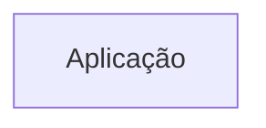
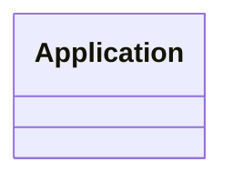

# Arquitetura

## Objetivo

O Dashboard de Protocolos é uma SPA React/Vite de consulta operacional. Toda a
agregação atual acontece no navegador depois do carregamento inicial.

O backend próprio fica em `backend/` e expõe a mesma ideia de registro
normalizado via Fastify. O PostgreSQL é a fonte operacional alvo; o Apps Script
permanece como fonte de transição para importação.

## Camadas

### Fonte

O frontend usa, nesta ordem:

1. `VITE_PROTOCOLS_API_URL`, quando configurada;
2. `VITE_SHEETS_URL`, apontando para o Web App do Apps Script;
3. dados mock, quando nenhuma URL estiver configurada.

### Serviço de dados

[`src/services/sheetsService.js`](../src/services/sheetsService.js):

- executa `fetch`;
- aceita `rows`, `data` ou array direto;
- valida payload;
- normaliza datas, canais, tipos, unidades e `Mes_Origem`;
- grava e lê cache do `localStorage`;
- devolve erro de rede, contrato ou estrutura.

### Estado global

[`DashboardContext.jsx`](../src/context/DashboardContext.jsx) mantém registros,
projeção filtrada, filtros, refresh, origem, timestamp e erros. O refresh
automático ocorre a cada 15 minutos.

### Projeções e interface

[`useKPIs.js`](../src/hooks/useKPIs.js) calcula indicadores e séries derivadas.
[`chartData.js`](../src/utils/chartData.js) mantém as cinco maiores categorias e
agrupa o restante em `Outros`.

- `FilterBar`: filtros globais;
- `KPICards`: indicadores;
- `DonutChart`: canais;
- `BarChart`: Top 5 tipos;
- `UnitChart`: volume por unidade;
- `RecentTable`: busca, ordenação, paginação, detalhe e CSV.

## Decisões de visualização

O cruzamento completo de tipo por unidade foi substituído por rankings
independentes porque uma matriz esparsa gera muitas barras vazias. O modal
explica a composição de `Outros` sem poluir a visão principal.

## Regras de dependência

- Componentes não chamam `fetch` diretamente.
- Contratos de payload são definidos em `protocolContract.js`.
- A troca para API REST ocorre no serviço, sem duplicar lógica na interface.
- Filtros não alteram `todosProtocolos`; criam `protocolosFiltrados`.

<!-- specsfy:documentator:start -->
## Componentes

| Tipo | Quantidade |
| --- | --- |
| Código | 35 |
| Testes | 3 |

## Diagramas

<!-- specsfy:documentator:end -->
