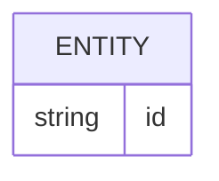

# Banco de dados

<!-- specsfy:documentator:start -->
## Fontes de persistência

| Arquivo |
| --- |
| backend\prisma\migrations\0001_init\migration.sql |
| backend\prisma\migrations\0002_triage_recommendations\migration.sql |
| backend\prisma\schema.prisma |
| backend\src\prisma.ts |
| Nenhuma estrutura confirmada além das fontes listadas. |

<!-- specsfy:documentator:end -->
