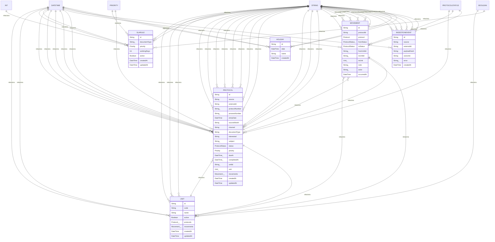

# Banco de dados

<!-- specsfy:documentator:start -->
## Mapa de persistência

| Entidade/Tabela | Campos | Relações | Fonte |
| --- | --- | --- | --- |
| Holiday | id:String, date:DateTime, name:String, createdAt:DateTime | String, DateTime, String, DateTime | `backend/prisma/schema.prisma` |
| IngestionEvent | id:String, source:String, externalId:String, payloadHash:String, outcome:String, error:String?, createdAt:DateTime | String, String, String, String, String, String, DateTime | `backend/prisma/schema.prisma` |
| Movement | id:String, protocolId:String, protocol:Protocol, fromStatus:ProtocolStatus?, toStatus:ProtocolStatus, fromUnitId:String?, toUnitId:String?, toUnit:Unit?, note:String?, actor:String?, occurredAt:DateTime | String, String, Protocol, ProtocolStatus, ProtocolStatus, String, String, Unit, String, String, DateTime | `backend/prisma/schema.prisma` |
| Protocol | id:String, source:String, externalId:String, protocolNumber:String?, processNumber:String?, entryDate:DateTime, sourceMonth:String, channel:String, documentType:String, interested:String, subject:String?, status:ProtocolStatus, priority:Priority, dueAt:DateTime?, completedAt:DateTime?, unitId:String?, unit:Unit?, movements:Movement[], createdAt:DateTime, updatedAt:DateTime | String, String, String, String, String, DateTime, String, String, String, String, String, ProtocolStatus, Priority, DateTime, DateTime, String, Unit, Movement, DateTime, DateTime | `backend/prisma/schema.prisma` |
| SlaRule | id:String, documentType:String?, priority:Priority, workingDays:Int, active:Boolean, createdAt:DateTime, updatedAt:DateTime | String, String, Priority, Int, Boolean, DateTime, DateTime | `backend/prisma/schema.prisma` |
| Unit | id:String, code:String, name:String, active:Boolean, protocols:Protocol[], movements:Movement[], createdAt:DateTime, updatedAt:DateTime | String, String, String, Boolean, Protocol, Movement, DateTime, DateTime | `backend/prisma/schema.prisma` |

## Fonte complementar

Consulte [`.specsfy/DATABASE.md`](../.specsfy/DATABASE.md) para decisões,
ownership, retenção e detalhes humanos não inferíveis.
<!-- specsfy:documentator:end -->
