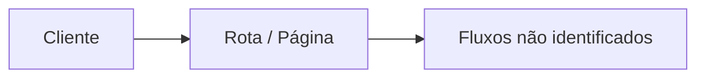
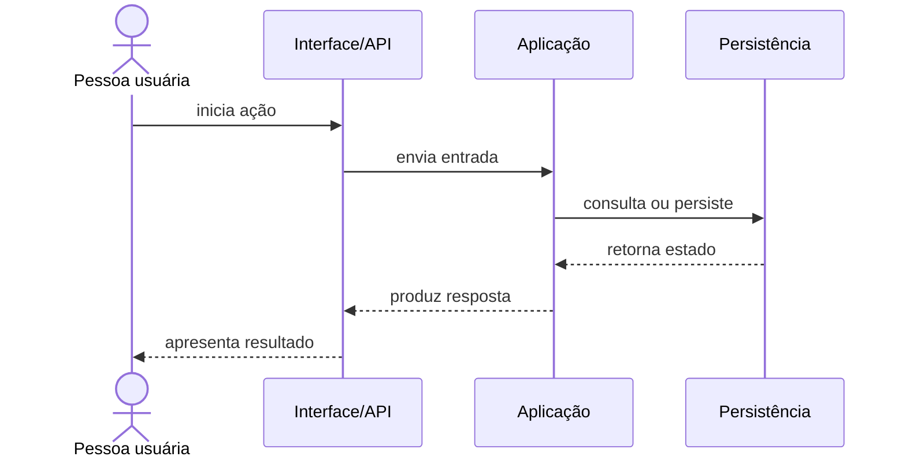

# Fluxos

<!-- specsfy:documentator:start -->
## Entradas observadas

| Método/Tipo | Caminho | Destino observado |
| --- | --- | --- |
| Não identificado | Não identificado | Não identificado |

## Fluxo de navegação e requisição

## Sequência representativa

<!-- specsfy:documentator:end -->
