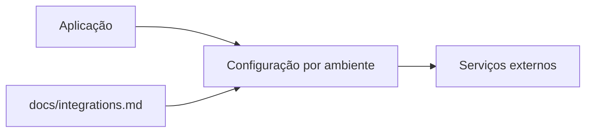

# Integrações

<!-- specsfy:documentator:start -->
## Integrações observadas

| Sinal | Tipo | Fonte segura |
| --- | --- | --- |
| VITE_PROTOCOLS_API_KEY | variável de ambiente | `.env.example` (somente nome) |
| VITE_PROTOCOLS_API_URL | variável de ambiente | `.env.example` (somente nome) |
| VITE_SHEETS_URL | variável de ambiente | `.env.example` (somente nome) |

## Mapa

Valores de ambiente, credenciais e endpoints privados não são publicados.
Confirme autenticação, timeout, retry e ownership quando não estiverem
expressos no código.
<!-- specsfy:documentator:end -->
